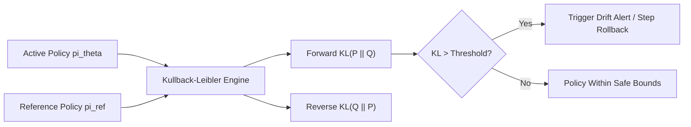

# genpark-kullback-leibler-divergence-drift-monitor-skill

Telemetry monitor calculating forward, reverse, and symmetric Kullback-Leibler (KL) divergence to prevent reward hacking.

## Architecture

## Features
- **Symmetric & Asymmetric Drift**: Tracks both mode collapse and out-of-distribution tokens.
- **Zero Dependencies**: 100% Python Standard Library.
